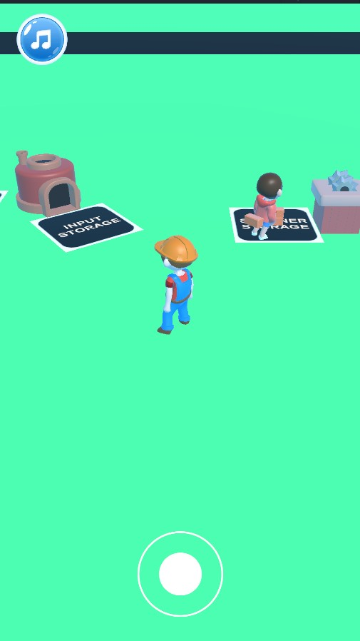
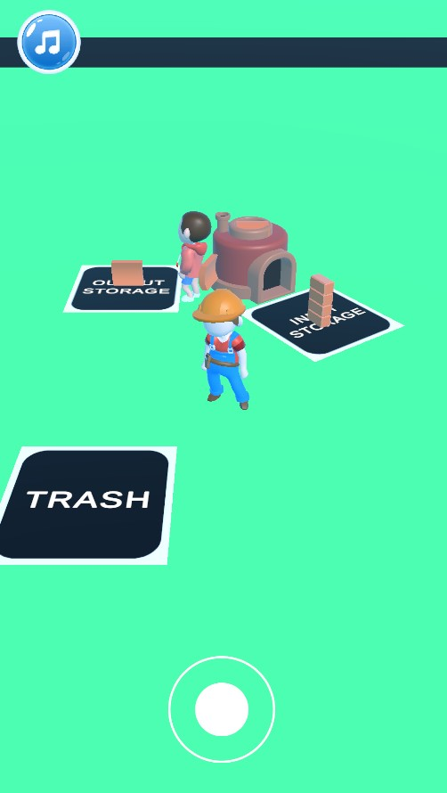
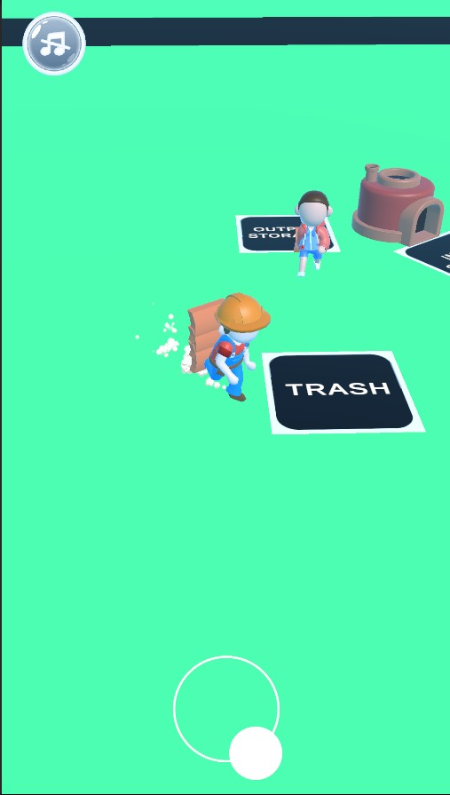

# 📱 Idle Arcade Case Project

> **Click the link above** to instantly try out the game in your browser via **Unity Play**!

This project was developed as a **Mobile Idle Arcade Case Study** for **Noko Games**.

The goal of this case is to demonstrate **core gameplay mechanics**, **clean code structure**, and a **scalable architecture** suitable for casual/idle mobile games.

---

## 🖼️ Project Screenshots

Screenshots showcasing the key moments of the gameplay loop. The images are linked using local relative paths:

  
  
  

---

## ✅ Implemented Features

* **Player Movement:** Implemented with a **stack–based item carrying system**.
* **Spawner System:** Features **capacity-based** item production.
* **Storage Logic:** **Input & Output Storage** logic with item filtering capabilities.
* **Asset Transformer:** Converts raw items into processed items based on a recipe.
* **Trash Can:** System for disposing of allowed items.
* **Architecture:** Modular structure following **SOLID, KISS**, and clean code principles.

---

## 🧩 Core Gameplay Loop

The primary workflow of the game follows this sequence:

> Spawner → Input Storage → Asset Transformer → Output Storage → Trash Can

---

## 🛠 Tech & Requirements

| Category | Detail |
| :--- | :--- |
| **Game Engine** | Unity 2022.3.24f1 LTS |
| **Renderer** | Universal Render Pipeline (URP) |
| **Language** | C# (with Interface-based architecture) |
| **Extra Techniques** | Object Pooling |
